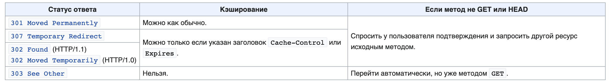

# HTTP requests tutorial.

## Basic definitions.
    > HTTP - hypertext transfer protocol. Data transfer protocol of application level.

### Main characteristics:

* Client-Server technology:
    > Client initiates a connection and send queries. Server waits for connection 
    > for getting query, processes query and return the result.
* HTTP is used as transport for another application level protocols.
* **URI** (Uniform resource identifier) point the main object of HTTP-manipulations.
    It may be a file, logical object or something abstract.
* HTTP can specify different ways of presentation for the resource
  (format, encoding, language etc.) in request and response, 
  that makes possible to send binary data between client and server.
* HTTP **doesn't save its status**. _Components may save status of last 
  request-response pairs by its own. For example Cookie._
* HTTP creates new TCP sessions for every request.
* HTTP indicates type of sending data in a special header "Content-Type"

### Main categories of software for HTTP.
* **Servers** - the main supplier for services of information storing 
  and processing (Origin server). 
* **Client** - the end-point consumer of server's services. 
* **Proxy** - agent in transporting services.

    > The same software may be a server, client or proxy depending 
    > on its current role.

## Structure of HTTP-request.
* **Starting line** - indicates message type.
* **Headers** - describe message body, transfer's parameters and other options.
* **Message Body** - message data. Must be separated with empty line from 
  another part of message.
    > _Message body may not exist, but another parts of HTTP-request 
    > are obligatory._

### Starting Line.
* Abstract request:
```http request
selected_method URI HTTP/Version
```
* Example of request:
```http request
GET /wiki/HTTP HTTP/1.1
Host: ru.wikipedia.org
```
* Abstract response:
```http request
HTTP/Version StatusCode ReasonPhrase
```
> **Version** is like in request, **Status Code**, **Reason Phrase** is a short 
> text explanation for response's code for an user.
* Example of response:
```http request
HTTP/1.1 200 OK
```

### **Methods**.
> **HTTP Method** - sequence of any symbols, except of operators 
> and splitters, indicates the main operation for resource. Usually 
> methods are named with upper-case english word. Registry sensitive.

#### OPTIONS
> Method returns possibilities of web-server or connection's parameters for 
> only resource. Response should include a header _allow_ with supported 
> methods, sometimes may include information about supported extensions.
* Request for exploring possibilities of entire server. May be used as ping.
  result doesn't cache.
```http request
OPTIONS * HTTP/1.1
```

#### GET
> Method returns contents of selected resource. Also, it's possible to start some 
> processes, information about progress should be included in response's body 
> in that case. 
> Example of passing parameters:
```http request
GET /path/resource?param1=value1&param2=value2 HTTP/1.1
```

#### HEAD
> Method is analog of GET, but doesn't contain a message's body.
> Usually it's used for getting metadata, checking for resource existing
> (URL validation) and resource version.
> **Headers of response may be cached.**

#### POST
> Usually method is used for transfer user's data enclosed in the request 
    to selected web-resource. If the resource was created, method returns
    URI of this resource in response. **Response isn't cached**.

#### PUT
> The PUT method requests that the enclosed entity be stored under the supplied URI. 
> If the URI refers to an already existing resource, it is modified; 
> if the URI does not point to an existing resource, 
> then the server can create the resource with that URI.
> 
> Unlike POST, PUT doesn't suggest that enclosed in request content 
> will be processed by the server.
> 
> **Response isn't cahed**

#### PATCH
> Method is similarly to PUT, but applies only to the fraction 
> of the resource.

#### DELETE
> Method deletes selected resource.

#### TRACE
> Method returns response with information about the changes, 
> that staged servers makes with the request.

#### CONNECT
> Transform the request connection to transparent TCP/IP tunnel.
> Usually it contributes to establish protected SSL-connection through
> the unprotected proxy.

### **HTTP status codes**
> Part of the first line of the server's response on HTTP-requests.

#### 1xx - Informational:
* 100 - Continue
* 101 - Switching Protocols
* 102 - Processing
* 103 - Early Hints

#### 2xx - Success:
* 200 - OK 
  > Data may be enclosed in a message body or in a header.
* 201 - Created 
  > Preferred address of created resource is in 
  > field Location. Format of response body contains in field
  > Content-Type.
* 202 - Accepted 
  > Request is accepted for processing.
* 203 - Non-Authoritative Information
  > Status is similar to 200, but information was received from another server
  > or copy of the basic server.
* 204 - No Content
  > Response contains only headers. Client shouldn't update the content, but can
  > apply received metadata to content.
* 205 - Reset Content
  > Server obliges client to reset user's inputted data. Response doesn't contain
  > message body.
* 206 _ Partial Content
  > Success processing of Partial GET request.
* 207 - Multi-Status
  > Server returns results of processing several independent operations.
* 208 - Already Reported
  > Members of DAV binding have already reported in previous part of Multi-Status
  > response.
* 226 - IM used
  > A-IM header was successfully received from the client.

#### 3xx - Redirection:

* 300 - Multiple Choices
  > URI contains several options for providing a resource.
* 301 - Moved permanently
  > The requested document was finally transferred to the address, enclosed in field Location.
* 302 - Moved temporarily or Found
  > The requested document is temporarily available at the address, specified in
  > the field Location.
* 303 - See Other
  > The document should be requested from the address in the field Location 
  > with GET-method.
* 304 - Not Modified
  > Server returns that code if client use GET-method with headers 
  > If-Modified-Since or If-None-Match and requested document haven't
  > been changed since specified moment. Response shouldn't contain
  > message body.
* 305 - Use Proxy
  > Request should be processed through the proxy in field Location.
  > This response code isn't allowed for a proxy server, only for an original.
* 307 - Temporary Redirect
  > Method is similar to 302, but POST/GET method mustn't be changed in the second
  > request.
* 308 - Permanent Redirect
  > Method is similar to 301, but POST/GET method mustn't be changed in the second
  > request.

#### 4xx - Client Error:
* 400 - Bad Request
  > There's a syntax error in a client's request.
* 401 - Unauthorized
  > Authentication is required for the resource. In response header
  > should be the field WWW-Authenticate with authentication conditions.
* 402 - Payment required
* 403 - Forbidden
  > Client isn't allowed to operate requested resource.
* 404 - Not Found
* 405 - Method Not Allowed
  > Response should enclose allowed methods in the header ALlow.
* 406 - Not Acceptable
  > The requested URI can't accept characteristics that enclosed in
  > request's header.
* 407 - Proxy Authentication Required
  > Code is similar to 401, but for a proxy server.
* 408 - Request Timeout
* 409 - Conflict
  > Conflict for the resource.
* 410 - Gone
  > Resource has been at this URL, but was deleted. Current address is unknown.
* 411 - Length Required
  > Client should specify Content-Length in request header.
* 412 - Precondition Failed
  > This code returns if all conditional header fields aren't successful.
* 413 - Payload Too Large
  > Request body is too large. Response may enclose header Retry-After
  > if the problem is temporary.
* 414 - URI Too Long
  > Also returns when the client tries to transfer too long parameters 
  > in method GET, not in POST.
* 415 - Unsupported Media Type
* 416 - Range Not Satisfiable
* 417 - Expectation Failed
* 418 - I'm a teapot
* 419 - Authentication Timeout (not in RFC 2616)
* 421 - Misdirected Request
  > Request was redirected to the server, that isn't allowed to give a response.
* 422 - Unprocessable Entity
  > Message body has correct syntax, but it contains a logical error, that's
  > not able to be processed.
* 423 - Locked
  > Target resource is blocked by the pointed method.
* 424 - Failed Dependency
  > Depended operation was failed.
* 425 - Too Early
  > 
* 426 - Upgrade Required
* 428 - Precondition Required
* 429 - Too Many Requests
* 431 - Request Header Fields Too Large
* 449 - Retry With
* 451 - Unavailable For Legal Reasons
* 499 - Client Closed Request

#### 5xx - Server Error:
* 500 - Internal Server Error
  > Any outlaw error.
* 501 - Not Implemented
  > Server isn't able to process the request. Usually this response
  > returns when method isn't supported.
* 502 - Bad Gateway
  > Server as a gate has received invalid response from the upstream
  > server.
* 503 - Service Unavailable
  > Server is unavailable by technical reasons (maintenance, reboot etc.)
* 504 - Gateway Timeout
  > Server as a gate hasn't received respons from the upstream server.
* 505 - HTTP Version Not Supported
* 506 - Variant Also Negotiates
* 507 - Insufficient Storage
  > The free space isn't enough for completing current request.
* 508 - Loop Detected
  > Server finds out an infinite loop.
* 509 - Bandwidth Limit Exceeded
  > Web-site has exceeded the limit of traffic.
* 510 - Not Extended
  > The requested extension is absent on the server.
* 511 - Network Authentication Required
  > This response is return by the proxy server, not by the origin, when it
  > needs to authenticate user in this proxy.
* 520 - Unknown Error
* 521 - Web Server Is Down
* 522 - Connection Timeout
* 523 - Origin is Unreachable
* 524 - A Timeout Occurred
* 525 - SSL Handshake Failed
* 526 - Invalid SSL Certificate

