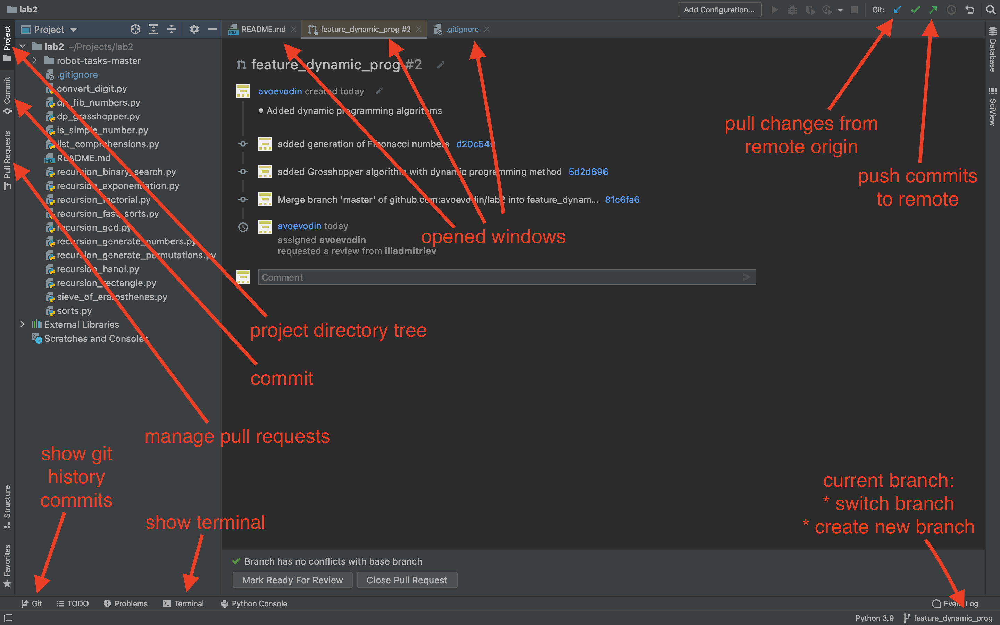

# Repository for demonstrating best-practices for git, github, PyCharm etc.
##### This readme-file contains the tutorial for convenient work with git, zsh,
##### PyCharm. 
---

## First level: initial settings for git, first steps in git.
###### Creating first repository, ssh id RSA keys, git add, commit, push
---

### brew

* Install brew https://brew.sh
```
/bin/bash -c "$(curl -fsSL https://raw.githubusercontent.com/Homebrew/install/HEAD/install.sh)"
```
* Install python 3.9
```
brew search python
brew install python@3.9
```

### ssh

* Generate ssh id RSA key private and public
```
ssh-keygen
```

> ~/.ssh/id_rsa - private part
> ~/.ssh/id_rsa.pub - public part (may be uploaded to github)

```
cat ~/.ssh/id_rsa.pub # show public key in terminal
```

### github

* Upload public part to github https://github.com/settings/keys
* Create new empty repository "saved url"

### git

* Set git global params 
```
git config --global user.name "Your Name"
git config --global user.email your@email.com
```
* Create folder
```
mkdir ~/Projects/test-repository
cd ~/Projects/test-repository
```
* Init repository
```
git init
```
* Create file
```
touch README.md
git add README.md
```
* Commit to local repository
```
git commit -m 'added README.md'
```
* Push to remote repository
```
git remote add origin "saved url"
git push --set-upstream origin master
```
* Git check status

```
git status
```
* Abort changes in a file
> It's recommended to use -- and set full path of file into
> the rep-directory
```
git checkout -- path/to/file_name.py
```
---
## Second level: tuning terminal
###### Tuning zsh, git and terminal
---

* Install command-line tools to BBEdit:
    > open BBEdit and BBEdit => Install Command Line tools
* Install themes oh-my-zsh: themes for zsh
    > https://ohmyz.sh/#install

```
compaudit | xargs chmod g-w,o-w # after installing, remove permissions on writing for
                                # owner and group
``` 
                                
```
bbedit ~/.zshrc # Settings for shell (11 raw contains shell name)
```
> if delete dir in 5-th raw, all settings will be deleted 
> (ex /Users/avo888/.oh-my-zsh)

* Correct of theme (ex /Users/avo888/.oh-my-zsh/themes) robbyrussell.zsh-theme
> Example of settings. 
> Docs: http://zsh.sourceforge.net/Doc/Release/Prompt-Expansion.html

* There's example of corrected settings-file below:
```
# PROMPT="%(?:%{$fg_bold[green]%}➜ :%{$fg_bold[red]%}➜ )"
# PROMPT+=' %{$fg[cyan]%}%c%{$reset_color%} $(git_prompt_info)'

PROMPT="%D %* %{$fg[red]%}%n%{$reset_color%}@%{$fg[blue]%}%m %{$fg[yellow]%}%~ %{$reset_color%}%% "
PROMPT+='$(git_prompt_info)'

ZSH_THEME_GIT_PROMPT_PREFIX="%{$fg_bold[blue]%}git:(%{$fg[red]%}"
ZSH_THEME_GIT_PROMPT_SUFFIX="%{$reset_color%} "
ZSH_THEME_GIT_PROMPT_DIRTY="%{$fg[blue]%}) %{$fg[yellow]%}✗"
ZSH_THEME_GIT_PROMPT_CLEAN="%{$fg[blue]%})"
```
* Settings for Terminal:
> Terminal: Terminal => Preferences => Homebrew (make default
> in down the screen) 
> Right column: Font => Fixed width => PT mono => Bold and Size = 13

* Turn off pager in terminal:
```
git config --global core.pager ''
```
* If is needs to turn on pager in terminal:
```
git config --global core.pager 'less' 
```
* Set editor to BBEdit (from vim to BBEdit):
```
# wait and resume parametres
# are for wait in command line and
# resume after close file
git config --global core.editor 'bbedit --wait --resume'
```
* Set editor to VIM:
```
git config --global core.editor 'vim'
```
---
## Third level: branches
###### Creating new branch and working with it. Types of branches.
---

* Types of branches

    1. Master - only approved code = Production
    2. Develop - developers branch. Used by developers for test-approved developings. 
                 Code which builds without problems, test passes etc
    3. Feature branche - individual branche for each task and each developer.

* Creating new branch from master:
```
git checkout master # switch to master
git pull # get last changes from server with strategy merge (by default)
git branch feature_themes # add feature brunch with branch name
                          # it's recommended to name feature branch
                          # like feature_ + 'name of branch'
git checkout feature_themes # switch to created branch
# making changes...
git add ...
git commit 
git push --set-upstream origin feature_themes
# You can open showed link, or go to  github and create pull-request
# (in gitlab merge-request, that equal pull-request in github)
```
---
## Fourth level: PyCharm
###### Explore basic tools in PyCharm.
---


* To update the trial period use:
```shell
chmod +x reset.once.sh
./reset.once.sh
```

---
## Fifth level: venv
###### Creating new virtual environment and fixing it in requirements.txt
---

* Create new virtual environment in "venv" directory
```shell
python3 -m venv venv
```
* Activate environment in macOS
```shell
source venv/bin/activate
```
* For example install module in current environment
```shell
pip3 install coverage
```
* Output installed module and forward it to requirements.txt
```shell
pip freeze > requirements.txt
```
* Deactivate current virtual environment
```shell
deactivate
```
* Delete created directory venv
```shell
rm -rf venv
```
* Repeat steps to create new environment. Install modules from requirements.txt
```shell
pip install -r requirements.txt
```

---
## Lifehacks
##### Some tricks that make coding more comfortable
---

* To look at all commits in current branch:
```
git log
```
* To look at selected commit:
```
git show selected_commit_hash
```
* Hide command in history
> Print space before command to hide it in history
* Instructions for Mark-down 
> https://github.com/adam-p/markdown-here/wiki/Markdown-Cheatsheet
* Quit from Less (linux pager): Q or ctrl+c
* Invite collaborator
> https://github.com/avoevodin/test-repository/settings/access
* Determine file properties
```
# Look at some file path (-a means that you'll see all paths for that name)
which -a python
# Determine file type and it's properties
file python
```
* Install tree utility
```shell
brew install tree
```
* freeze prints out list of modules installed in current environment
```shell
pip freeze
```
* For removing attribute of the file:
```shell
xattr -r -d com.apple.quarantine reset.once.sh
xattr reset.once.sh # For check attributes.
```

* For using code with no quality assurance use comment:
```python
# noqa
```